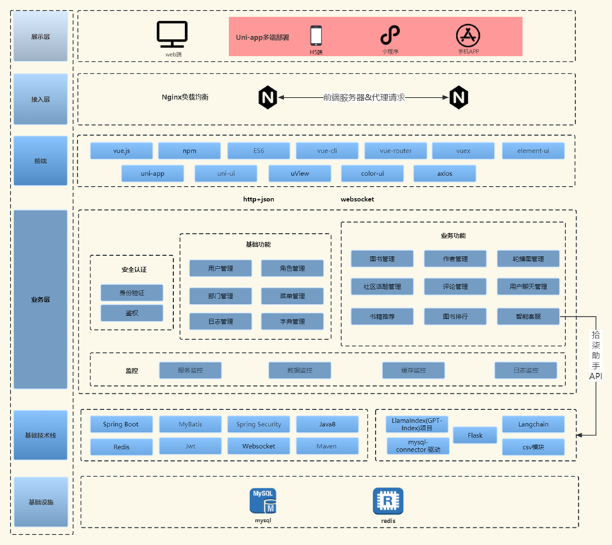
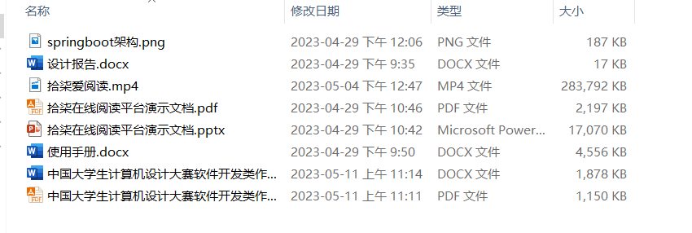

#  项目介绍

为响应“学习强国”理念，增强“全民阅读”意识。为此，我们推出了这个长篇书籍阅读分享平台。现代人生活忙碌，阅读时间少。碎片化阅读虽快捷，却有诸多弊端，如浅表、误导、失落等。你可以在这里找到各类书籍和书评，按照兴趣选择阅读，并记录分享心得感受。你也可以和其他读者交流讨论，拓展视野知识。我们希望通过这个项目，让更多人享受阅读的乐趣和收获，培养阅读习惯和能力，提升文化素养和人文关怀。本作品对标了豆瓣和网易云阅读两个平台，将豆瓣的书评特色功能与网易云阅读的在线阅读功能相结合，使得用户拥有更好的功能体验。
下表为竞品分析表格：
<table>
   <tr>
      <td>维度</td>   
      <td>拾柒爱阅读</td>   
      <td>豆瓣</td>   
      <td>网易云阅读</td>   
   </tr> 
    <tr>
      <td>在线阅读</td>   
      <td>支持PDF格式，目录、笔记功能</td>   
      <td>不支持在线阅读，只能查看图书信息、评论、购书单等内容</td>   
      <td>支持多种格式，目录、书签、笔记功能</td>   
   </tr>
   <tr>
      <td>书评功能</td>   
      <td>支持写书评、点赞、评论，查看他人书评和推荐，形成社交氛围</td>   
      <td>有豆瓣最受欢迎的书评资源</td>   
      <td>只支持查看他人评论</td>   
   </tr> 
   <tr>
      <td>其他功能</td>   
      <td>支持模糊搜索、基于ChatGPT为平台的智能客服、加入书架、喜欢，个性化推荐、在线聊天</td>   
      <td>支持搜索、分类浏览、收藏、推荐，个性化推荐</td>   
      <td>同豆瓣</td>   
   </tr> 
</table>

1. 所有使用到的框架或者组件都是基于开源项目，代码保证100%开源。
2. 目前应该可以称为是全网同类型开源项目中最美的 UI，设计细节满满。
3. 系统功能通用，无论是个人还是企业都可以利用该系统快速搭建一个属于自己的阅读 or 社区系统。

## 该项目，分为三个平台

1. 后台管理平台包括系统、图书和社区管理；
2. 前台阅读平台主要面向读者，包含阅读、社交等功能；
3. H5社区平台更专注于提供阅读和社区互动服务。

## 架构图

## :tw-1f4ab: 演示图&演示视频

### 演示视频： https://www.bilibili.com/video/BV1Xm4y1C7qA

# :tw-1f4cf: 准备工作

    JDK >= 1.8 (推荐1.8版本)
    Mysql >= 5.7.0 (推荐5.7版本)
    Redis >= 3.0
    Maven >= 3.0
    Node >= 12
    Python >= 3.9 (拾柒助手需要的环境，若不需要则不配置)

# :tw-1f4cb: 运行流程

1. 把仓库 v2.0 分支 clone下来 
   `git clone -b v2.0 https://gitee.com/cxq21/book.git`(指定v2.0分支)
   或fork到你自己的仓库

2. 使用idea打开项目，并加载Maven依赖

3. 创建数据库sq_book并依次导入数据脚本
    1. sq_book.sql

4. 将 assets 文件夹下的 shiqi 文件夹复制到 D 盘下 （该路径可以在 application.yml 中的 ruoyi.profile 修改）

4. 启动 redis 服务 （redis免安装版链接：https://pan.baidu.com/s/1MYmNxiY8JIOuXjVr0W_-5A 提取码：1234）

5. 配置 application.yml 里的 redis 信息，和 application-druid.yml 里的数据库信息

6. 启动项目，启动成功后访问 http://localhost:8080/

7. 再用idea单独打开sq-ui 执行 

   `npm install`

     如果 npm install 出现报错执行下面这行
    `npm install --registry=https://registry.npmmirror.com`

   `npm run dev`

8. 配置 src 目录下的 config.js 文件

9. 访问 http://localhost:80 默认账户/密码 admin/admin123

# :tw-1f4cb: 拾柒助手服务端运行流程

1、打开 chatbotapi1 中的 dbreader.py 文件，修改对应的数据库连接配置

2、执行 `pip install -r modules.txt`

3、执行 `python main.py`

# :tw-1f4cb: H5运行流程

### 准备工作

如果使用H5项目，在此基础上希望得到最大化的效率工具支持，那么HBuilderX是你的首选。

1、首先访问HBuilderX的官网网址：(https://www.dcloud.io/hbuilderx.html (opens new window))

2、打开上面的HBuilderX下载网址后点击页面上download，在弹出的对话框里选择适合自己电脑的HBuilderX版本下载。

3、在Windows10环境下下载后的文件是一个压缩的.zip文件，解压后双击运行HBuilderX.exe即可启动编辑器。

### 运行系统

`前置条件，需要先启动后端。`

1、点击HBuilderx，菜单 文件 -> 打开目录，然后选择sq-app项目，点击选择文件夹按钮，即可成功导入。

2、配置根目录下的 config.js 文件。

3、点击HBuilderx，菜单 运行 -> 运行到浏览器，然后选择浏览器类型，即可在浏览器里面访问。(也可小程序运行，自行百度)

4、运行成功可以通过(http://localhost:81 (opens new window))访问，出现如下图页面表示成功运行。

#### :tw-1f525: 最后

**记得给我一个星星喔，星星是我开源的动力，有技术上的问题欢迎进群讨论**

##### :tw-1f528: 有技术上的问题欢迎进群讨论（群里定期发放红包福利）

点击链接加入QQ群聊【LIEFox技术交流群】：https://jq.qq.com/?_wv=1027&k=XKRmblB9

哔站同步教程：https://www.bilibili.com/video/bv1Tr4y1q7Xx

**本项目有答辩视频、答辩演示文档、使用手册、开发设计文档等材料，只需捐赠 **9.9元** 即可全部材料发你，另外本项目还支持付费定制功能。（微信：xqw322814  本微信仅用作购买材料，若解答问题请到QQ群中提问；给口饭吃吧，开源不易~）**

